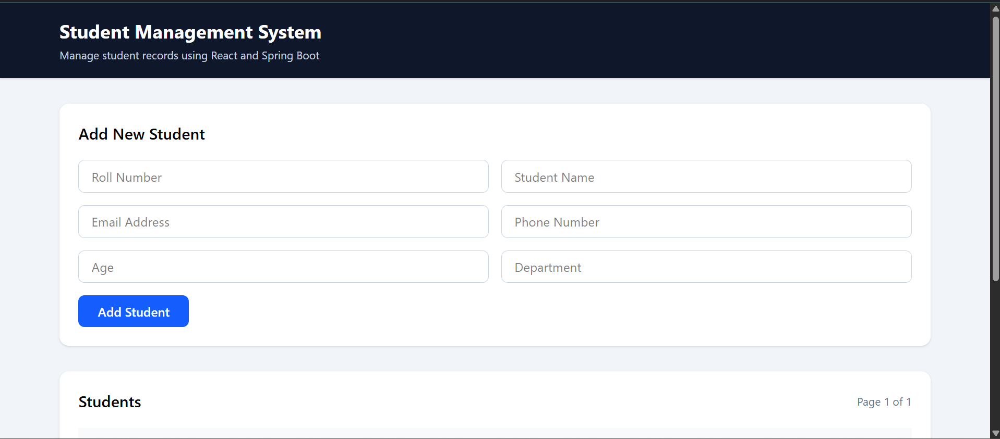
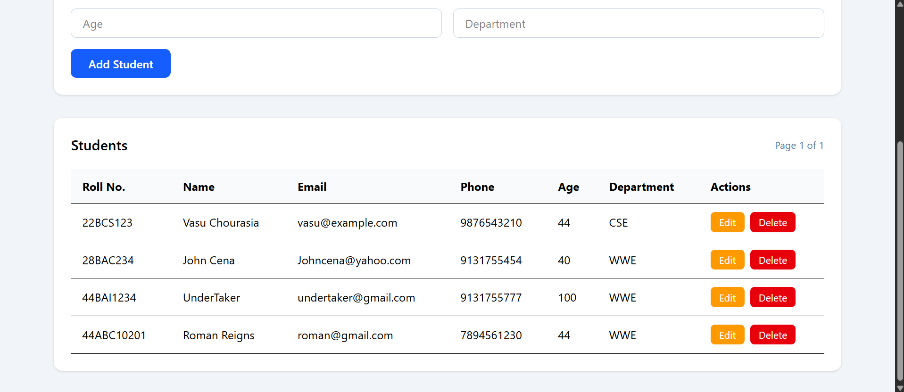

# Student Management System

A full-stack web application for managing academic student records, built with a **Spring Boot** REST backend, **MySQL** database, and a **React** frontend.

The system supports complete CRUD operations, server-side pagination, dynamic multi-field filtering using JPA Specifications, centralized validation, and OpenAPI 3.0 documentation.

---

## Screenshots

### 1. Add Student Form


### 2. Student Records Table & Management


---

## Tech Stack

| Layer | Technology |
| :--- | :--- |
| **Backend** | Java 17, Spring Boot 4, Spring Data JPA, Hibernate |
| **Database** | MySQL 8.x |
| **Validation** | Jakarta Bean Validation (`@Valid`, `@NotBlank`, `@Email`, `@Min`) |
| **API Docs** | SpringDoc OpenAPI 3.0 (Swagger UI) |
| **Frontend** | React, JavaScript (ES6+), CSS |
| **Build & Deploy** | Maven, Docker (Multi-Stage Build), Render |

---

## Features

- **Full CRUD Management:** Create, view, edit, and delete student records with immediate database synchronization.
- **Dynamic Multi-Field Search & Filter:** Query students simultaneously across `department`, case-insensitive `name` matching, exact `age`, and age ranges (`minAge` / `maxAge`) using Spring Data JPA `Specification` (Criteria API).
- **Server-Side Pagination & Sorting:** Handles large datasets efficiently using Spring Data `Pageable` (`page`, `size`, `sort`) to minimize network transfer overhead.
- **Data Integrity & Validation:**
  - Enforces field constraints on incoming payloads (`@NotBlank`, valid `@Email` format, `@Min(16)` for age).
  - Pre-validation checks for unique identifiers (`rollNumber` and `email`) before executing persistence logic.
- **Centralized Exception Handling:** Global `@RestControllerAdvice` translates domain exceptions (`StudentNotFoundException`, `DuplicateStudentException`, validation errors) into standardized JSON error responses.
- **CORS Configured:** Secure cross-origin resource sharing allowing client communication between decoupled frontend and backend services.
- **Interactive API Documentation:** Built-in Swagger UI for testing endpoints directly from the browser.
- **Dockerized Deployment:** Multi-stage `Dockerfile` with Eclipse Temurin JRE 17 for lightweight container deployment.

---

## System Architecture

```text
client (React Frontend)
       │
       ▼  HTTP / REST (JSON)
[StudentController]  ──> Handles routing, request mapping, and HTTP status codes
       │
       ▼
[StudentService]     ──> Business logic, uniqueness checks, DTO mapping
       │
       ▼
[StudentRepository]  ──> Spring Data JPA + JPA Specification (Dynamic Criteria queries)
       │
       ▼
[MySQL Database]     ──> Persistent storage (`student` table)
```

---

## API Reference

Base URL: `/students`

| Method | Endpoint | Description | Status Codes |
| :--- | :--- | :--- | :--- |
| `POST` | `/students` | Register a new student | `201 Created`, `400 Bad Request`, `409 Conflict` |
| `GET` | `/students` | Fetch paginated & filtered list | `200 OK` |
| `GET` | `/students/{id}` | Get single student by ID | `200 OK`, `404 Not Found` |
| `PUT` | `/students/{id}` | Update existing student record | `200 OK`, `400 Bad Request`, `404`, `409` |
| `DELETE` | `/students/{id}` | Remove a student record | `204 No Content`, `404 Not Found` |

### Query Parameters for `GET /students`

| Parameter | Type | Example | Description |
| :--- | :--- | :--- | :--- |
| `name` | String | `?name=Vasu` | Case-insensitive substring match |
| `department` | String | `?department=CSE` | Filter by exact department |
| `age` | Integer | `?age=21` | Filter by exact age |
| `minAge` | Integer | `?minAge=18` | Lower bound for age filter |
| `maxAge` | Integer | `?maxAge=25` | Upper bound for age filter |
| `page` | Integer | `?page=0` | Zero-indexed page number |
| `size` | Integer | `?size=10` | Records per page (default: 20) |
| `sort` | String | `?sort=name,asc` | Sort field and direction |

---

## Sample Request & Response Payloads

### 1. Create Student (`POST /students`)

**Request Body:**
```json
{
  "rollNumber": "24BCS001",
  "name": "Vasu Chourasia",
  "email": "vasu@example.com",
  "phone": "9876543210",
  "age": 21,
  "department": "CSE"
}
```

**Response (`201 Created`):**
```json
{
  "id": 1,
  "rollNumber": "24BCS001",
  "name": "Vasu Chourasia",
  "email": "vasu@example.com",
  "phone": "9876543210",
  "age": 21,
  "department": "CSE"
}
```

### 2. Error Response (`409 Conflict` - Duplicate Roll Number / Email)
```json
{
  "timestamp": "2026-09-20T02:00:00.000+00:00",
  "status": 409,
  "error": "Conflict",
  "message": "Roll number already exists",
  "path": "/students"
}
```

---

## Environment Variables

The backend application requires the following environment variables configured in `application.properties` or system environment:

| Variable | Description | Example |
| :--- | :--- | :--- |
| `DB_URL` | JDBC Connection String | `jdbc:mysql://localhost:3306/student_db?useSSL=false` |
| `DB_USERNAME` | Database username | `root` |
| `DB_PASSWORD` | Database password | `your_password` |
| `PORT` | Application server port (default: 8080) | `8080` |

---

## Local Setup & Installation

### Prerequisites
- **Java 17** or higher
- **Maven 3.8+**
- **MySQL 8.x**
- **Node.js 18+** (for frontend)
- **Docker** (optional)

### 1. Clone the Repository
```bash
git clone https://github.com/Vasu-Chourasia/student-management-api.git
cd student-management-api
```

### 2. Configure Database
Create a MySQL database:
```sql
CREATE DATABASE student_db;
```

Export the environment variables (Linux/macOS):
```bash
export DB_URL=jdbc:mysql://localhost:3306/student_db
export DB_USERNAME=root
export DB_PASSWORD=root
```
Or set them in Windows PowerShell:
```powershell
$env:DB_URL="jdbc:mysql://localhost:3306/student_db"
$env:DB_USERNAME="root"
$env:DB_PASSWORD="root"
```

### 3. Run Backend (Spring Boot)
```bash
mvn clean spring-boot:run
```
The API will start at `http://localhost:8080`.

- **Swagger UI Documentation:** `http://localhost:8080/swagger-ui/index.html`
- **OpenAPI JSON Spec:** `http://localhost:8080/v3/api-docs`

---

## Docker Deployment

You can containerize and run the backend using the multi-stage `Dockerfile`:

### Build Docker Image
```bash
docker build -t student-management-api .
```

### Run Container
```bash
docker run -d -p 8080:8080 \
  -e DB_URL="jdbc:mysql://host.docker.internal:3306/student_db" \
  -e DB_USERNAME="root" \
  -e DB_PASSWORD="root" \
  --name student-api \
  student-management-api
```

---

## Project Structure

```text
student-management-api/
├── src/
│   ├── main/
│   │   ├── java/com/vasu/studentmanagement/
│   │   │   ├── config/             # CORS and Swagger OpenAPI configuration
│   │   │   ├── controller/         # REST API Controllers (StudentController)
│   │   │   ├── dto/                # Request & Response DTOs
│   │   │   ├── entity/             # JPA Entities (Student)
│   │   │   ├── exception/          # Custom exceptions & GlobalExceptionHandler
│   │   │   ├── repository/         # Spring Data JPA Repository (JpaSpecificationExecutor)
│   │   │   ├── service/            # Core business logic
│   │   │   └── specification/      # JPA Criteria Specifications (dynamic filtering)
│   │   └── resources/
│   │       └── application.properties
│   └── test/                       # Unit & Slice test suite
├── Dockerfile                      # Multi-stage container build
├── pom.xml                         # Maven dependencies & build plugins
└── README.md
```

---

## License
This project is open-source and available under the [MIT License](LICENSE).
